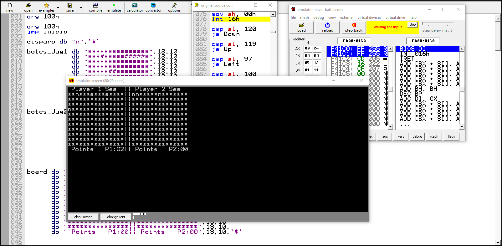

# Assembler naval battle

This a small project I built for one of my CS courses, a version of naval battle game coded in assembler.

You will need an emulator of an Intel 8086 microprocessor in order to run it. 

## Controls

- W to move up
- X to move down
- A to move left
- D to move right
- S to fire

## The game
You need to blind fire to the enemy sea to hit their boats. The "#" characters represent the tiles of that sea where ytou haven't fire, the "n" characters where your have fired and missed and the "s" characters where your have fired and hit and enemy boat.

**Preview of the game**

 